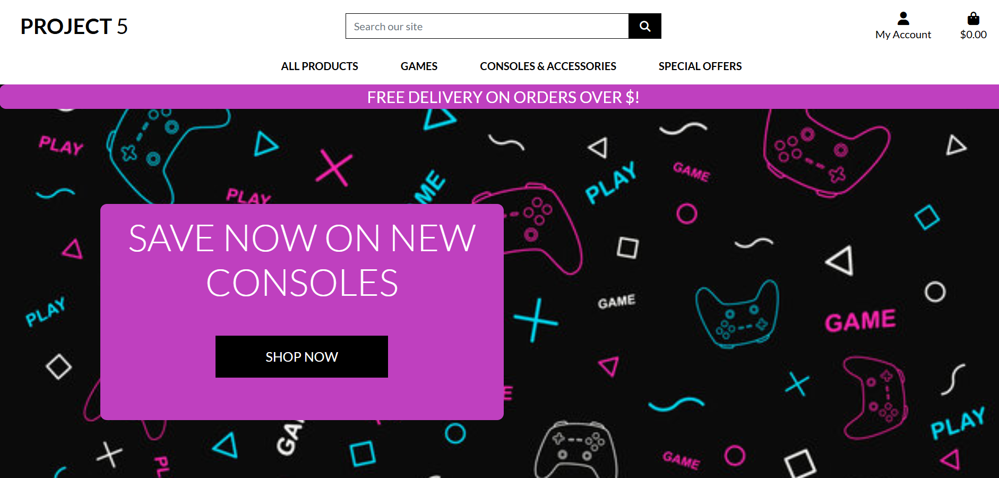
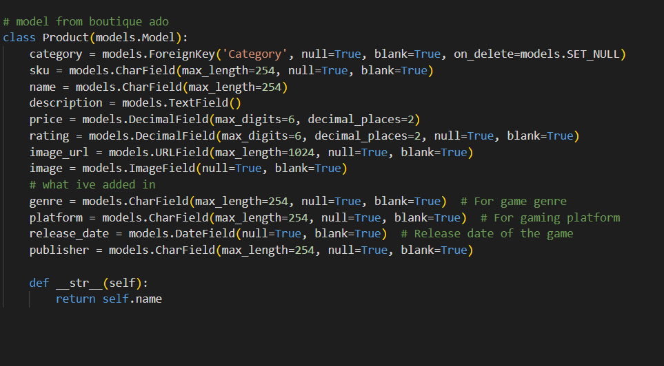

# Project 5

<h2></h2>

## A website about a game store website 

# Important! (to the test users/ graders only)

essentially what i have done for this project to try and show as much work as possible.

please go the bottom of the read.md first before continuing reviewing this!

# features 

while this project doesnt have alot of features, id like to show what makes this website stand out to the walkthrough project
(while this project does have more features, these features are unaltered from boutique ado so i will not add them.) 

- data models
- css and color alterations 
- custom fixtures 

<h2></h2>

apart from very minor details this project uses all of its resources from the boutique ado to:
- make sure everything runs and looks correct
- to help with time management 
- to make sure that everything used in this project does not break plagirism rules by using code i do fully understand 

## Features left to impliment

if i hadnt left this so late the features i would of like to implement to make this website stand out more and also what wouldve covered some of the criteria 

- CRUD functionality (in any way)
- any way to sort products 
- the search bar 
- a way to buy products 
- a personalised profile page 
- a way to see stock on products (a value on the data model)
-

# my User stories

i tried doing as much as i could in getting a way to have a to do list for all the thing i had to impliment

[User-Stories](https://github.com/RNXVIII/project-5-blog)

# Languages used 

[Python](https://www.python.org/)

[HTML5](https://en.wikipedia.org/wiki/HTML5)
 

[CSS3](https://en.wikipedia.org/wiki/Cascading_Style_Sheets)

# Diagrams, Flowcharts and ERDS

i sadly didnt have time to make any charts or diagrams for my project.

# deployment

the tool used to deploy this project is heroku.

to deploy a simple heroku app, you need to setupp the enviroment to herokus needs and also to link your repository

to deploy your repository on to heroku is simple:

create/sign in to an account 

create an "app" 

link your github account to your heroku account 

search for your repository 

adjust your app_config to its needs

search for your repository 

deploy it!

# Validators 

as this project isnt properly configured i havent validated anything but ill link all the validators i would of used

the [W3C CSS validator](https://jigsaw.w3.org/css-validator/validator)

the [W3C validator](https://validator.w3.org/)

the [JSHint](https://jshint.com/)

the [PEP8](https://peps.python.org/pep-0008/)

# Testing 

sadly i couldnt make any python test files to test my applications features

# Credit 

all credit in this project goes to [code-institute](https://codeinstitute.net/)

because of the boutique ado project

# Libaries and tools used

Font Awesome [icons](https://fontawesome.com/)

[bootstrap](https://getbootstrap.com/)

[google-Fonts](https://fonts.google.com/)

the packages i installed (for now) to make this was:

allauth
psycopg2

# Important

## why is the project like this?

honestly shortest awnser to this was i was lazy after my previous submissions and got lazy , i also thought that the project 5 deadline was on 15/11/24 and not the true 15/10/24 which didnt help

i used all of my time until 13/10/24 trying to get ready for the project 4 resubmission and was told to do as much as i can for project 5 so i have a submission and ever since the 13th (excluding friday , saturday and sundays) i have been using all my time trying to make some sort of project to show ive learned , tried and done work , appologies in advance while this does not excuse my behaviour or change my mark in anyway , its alot easier to understand why this project is so barbones when you know why .

## what am i going to do next 

i am going to continue doing all of the coursework and hopefully be able to give in a much more detailed project in the future

what i would of done if i had more time on the course is i would of followed more of the walkthrough and altered it to my needs to further insure im using all the time as efficently as i can.

## what criteria i havent covered 

i did add a couple things here there that would help with passing the criteria but i thought it be good to highligh it here 

SEO implementation, including:
A robots.txt file
A sitemap.xml file
Descriptive meta tags
rel attributes on links to external resources
Marketing techniques, including:
The need for the creation of either a real Facebook business page, or a mockup of one.
A newsletter signup form, either through a service such as MailChimp or through a custom implemented one.

The requirements for an e-commerce business model:

The necessity for the inclusion of an e-commerce business model, highlighting the purpose of the application as either B2B or B2C focused, and detailing the core business intents and marketing strategies for the application.

Implement a custom 404 page.

A custom 404 error page must be implemented for improved overall UX.
Remember to use and implement agile methodologies throughout your project creation.
Ensure you use an agile tool, such as Github projects, to track the tasks involved in creating your project.
Relate tasks to specifically identified user stories.
One or two tasks that cover all user stories will not be assessed as sufficient.

i also need to complete 

introduction to Search engine optimisation (SEO) 
Web marketing 

while i have done research and know a fairly good amount of SEO,SEM and more into digital marketing i still <b>NEED</b> and woulf very much like to cover these

## extra notes to grader

i appologise for what seems to be a lackluster project (again) , theres things in this project that show potential but it also lacks content. i wanted to show that i had actually learned and taken something away from this. 

after further revision and research im hopefull i can cover all criteria and finally be able to learn this useful yet exasperating framework.

that is all!!!

thank you for reading.